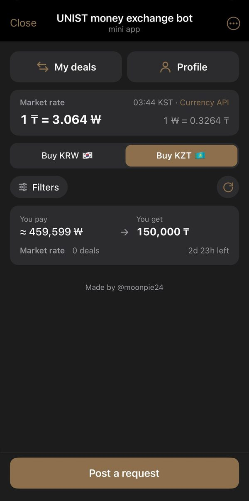
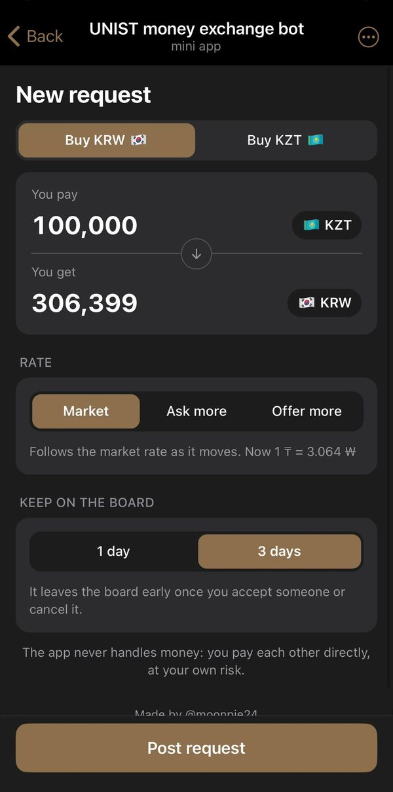
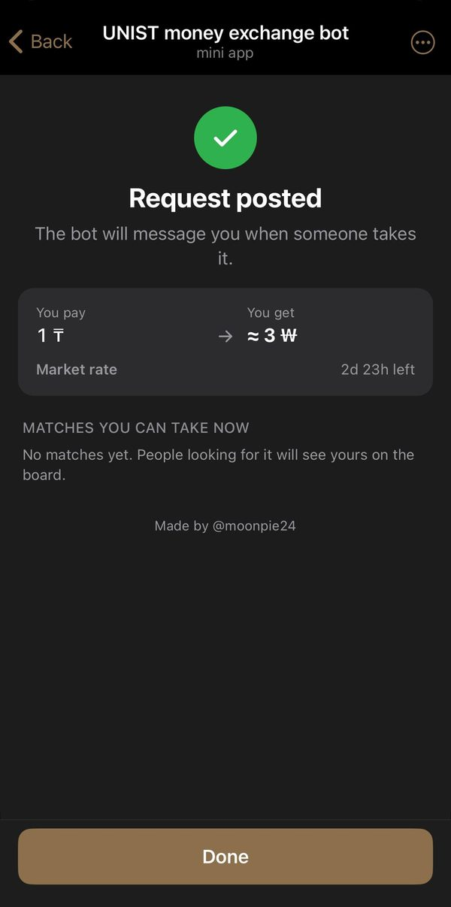
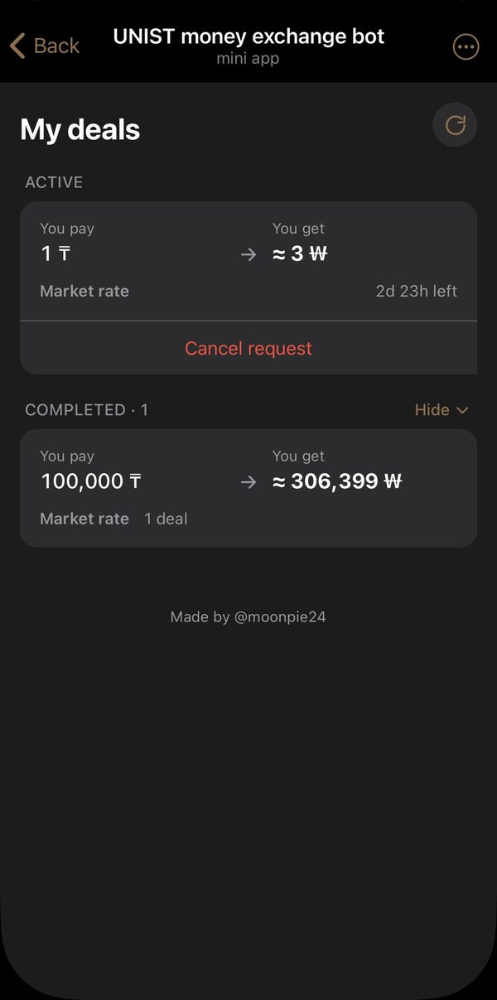
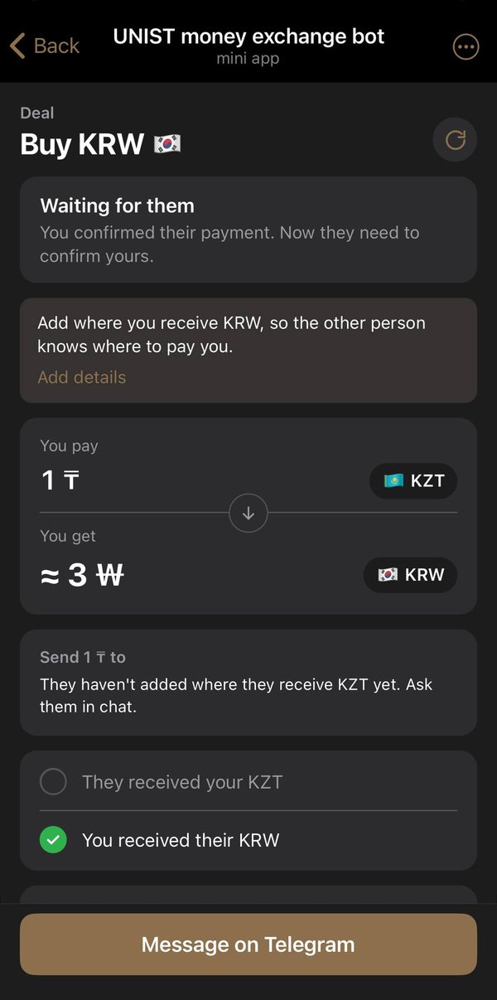
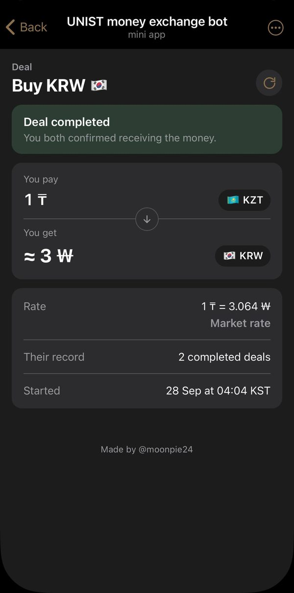
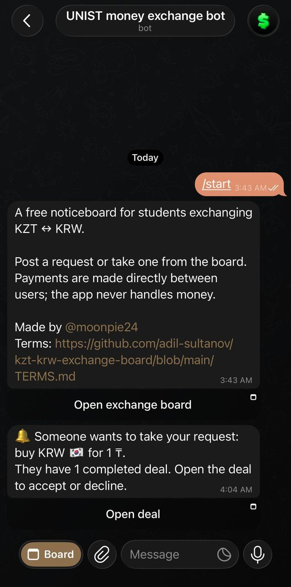

# KZT ↔ KRW Exchange Board

A Telegram Mini App where Kazakh students in Korea post and find **KZT ↔ KRW** exchange requests.

> **Status:** live, for members of our Telegram group chat only.

**Author:** Adil Sultanov ([@moonpie24](https://t.me/moonpie24)) · © 2026, all rights reserved

## Why

Exchanges used to be arranged in a busy group chat: open requests got buried, people kept
reposting, and there was no way to tell who had reliably completed exchanges before.

## Features

- **Board** of open requests ("Buy KRW" / "Buy KZT"), sortable by date or amount
- **Live market rate**: every request is at the reference rate; the amount you buy is fixed,
  what you pay moves with the rate until you accept someone, which locks it
- **Post a request** by typing what you pay *or* what you get; it expires after 1 or 3 days.
  Optionally name the bank you'd rather use for KZT ("Kaspi"), remembered for next time
- **Deals**: take a request → the author accepts (right from My deals, or on the deal) → both
  see each other's contact. Until the author answers, you can cancel your offer
- **Counter offers**: ask for part of a request (at least the author's optional minimum); once
  accepted, the rest stays on the board with its amount reduced
- **Profiles**: name, university and year of enrollment, shown as a tag on every request and
  deal ("Adil Sultanov, UNIST, 2022"); needed to post or take a request
- **Saved receiving details** (bank, account), shown only to the other side of an accepted deal
- **Bot notifications** when someone takes your request (or sends a counter offer), when
  your deal is accepted, and one reminder to confirm receiving the money if you haven't 3 h
  after acceptance (plus a red badge and notice on the Board)
- **Alerts** (opt-in, per Board tab): a one-line bot message for each new request ("Pay
  500,000 ₸ → Get ≈ 1,850,000 ₩") with a button to open it, crossed out once it's gone; sent at a
  steady pace under Telegram's rate limit
- **Matches** going the other way, shown after posting
- **Trust**: completed-deal counts, reports, admin review and bans; admins see every request
  on the board and can take any of them off it
- **Members only**: access is limited to one Telegram group chat

It **never holds or moves money** and is **free**, with no fees. Users pay each other directly.

## Stack

FastAPI · aiosqlite (SQLite) · aiogram 3 · APScheduler · React + Vite + TypeScript ·
Docker Compose + Caddy

## Development

Needs Python 3.12, Node.js 20+, a **test** bot from [@BotFather](https://t.me/BotFather) and
`cloudflared` (or ngrok) for HTTPS.

```bash
cp .env.example .env          # BOT_TOKEN, WEBAPP_URL, OWNER_ID; GROUP_ID optional

# Terminal 1: API + bot on :8000
cd backend
python3.12 -m venv .venv && .venv/bin/pip install -e ".[dev]"
.venv/bin/uvicorn app.main:create_app --factory --reload

# Terminal 2: Vite on :5173 (proxies /api to :8000)
cd frontend && npm install && npm run dev

# Terminal 3: HTTPS tunnel; put its URL in WEBAPP_URL
cloudflared tunnel --url http://localhost:5173
```

Restart the backend after changing `.env`, then send `/start` to the bot. Alternatively, run
`npm run build`: the backend serves `frontend/dist` itself, so you can tunnel port 8000 instead.

If the app doesn't load, run `scripts/dev-check.sh`: it checks `.env`, the backend, the build,
DNS and the tunnel, and points the bot's menu button at `WEBAPP_URL`. Then open the app from
a fresh `/start` reply (buttons in older messages keep old tunnel URLs).

Checks: `.venv/bin/pytest -q` · `.venv/bin/ruff check .` · `npm run typecheck`

## Deploy

One `app` container (API, bot and jobs) behind Caddy, which handles HTTPS.

1. A VPS with Docker, ports 80 and 443 open, and a domain's `A` record pointing at it.
2. A separate **production** bot from @BotFather.
3. On the server:
   ```bash
   git clone <repo> exchange-app && cd exchange-app
   cp .env.example .env    # BOT_TOKEN, DOMAIN, OWNER_ID, ADMIN_IDS, GROUP_ID
   docker compose up -d --build
   ```
4. **Group only**: add the bot to the group as an admin with every permission off, find its ID
   with `docker compose logs app | grep GROUP_ID`, set `GROUP_ID`, then `docker compose up -d`.

**Update:**
```bash
docker compose exec -u app app python -m app.backup
git pull && docker compose up -d --build
```

**Backups:** daily at 03:00 KST in `./backups/`, kept 14 days. They include receiving details,
so keep copies private (`rsync -a user@server:exchange-app/backups/ ./exchange-backups/`).
To restore: `docker compose stop app`, copy a backup over `data/exchange.db`, delete
`data/exchange.db-wal` / `-shm`, then `docker compose start app`.

## Screenshots

| Board | New request | Posted | My deals |
|:-:|:-:|:-:|:-:|
|  |  |  |  |

| Deal in progress | Deal completed | Bot |
|:-:|:-:|:-:|
|  |  |  |

## License

Copyright © 2026 Adil Sultanov. **All rights reserved.** Published for viewing only: you may
not copy, modify, host or redistribute it without written permission. See [LICENSE](LICENSE).

Use of the bot is subject to the [Terms of Use](TERMS.md) and [Privacy Policy](PRIVACY.md).
Exchanges happen directly between users, at their own risk.
